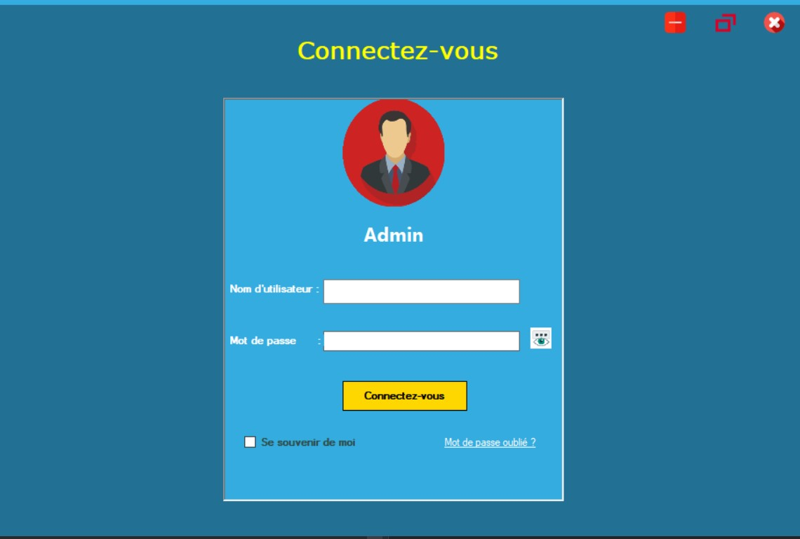
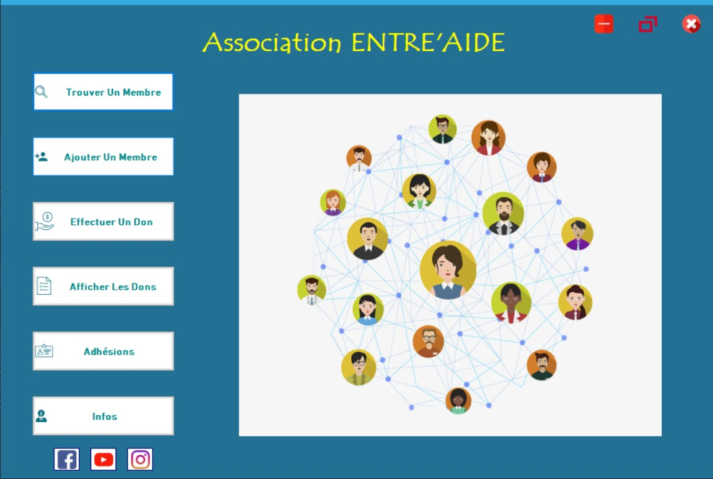
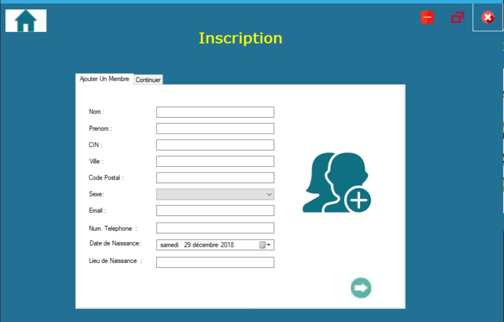
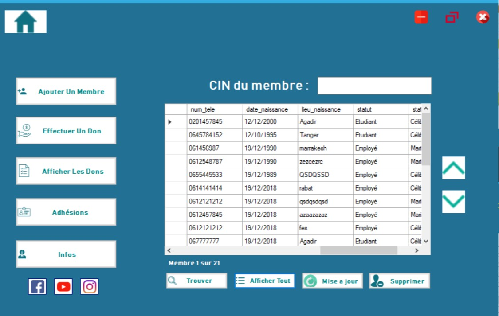
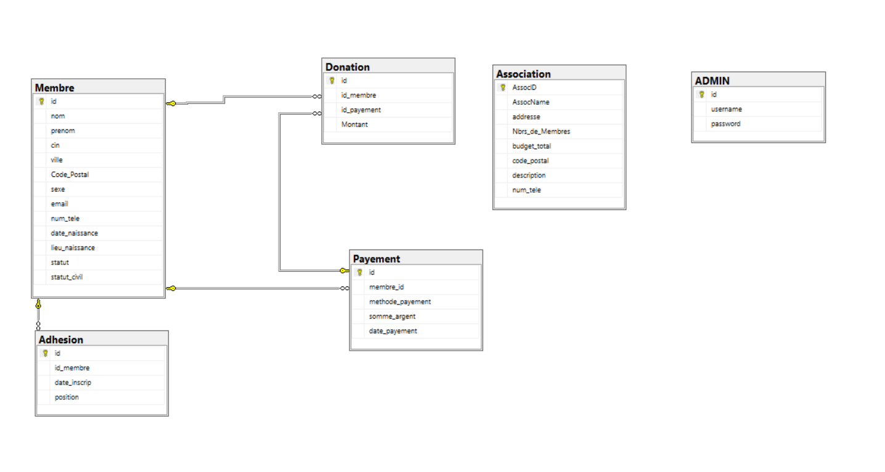

# Gestion_Association

C# desktop application to manage members of a certain association where you are able to show,add,remove,update members,
add a donation to the association and see a list of donators ...

# Screenshots
- Login (Username : admin // Password : admin)

- Home Page

- Add members

- Members

Icons From : https://www.flaticon.com/

# DataBase
Open sql server management studio or visual studio, create a database then in a new query copy what's inside [Tables.txt](Tables.txt) , [Stored_procedure.txt](Stored_procedure.txt) , [Triggers.txt](Triggers.txt)

# DataBase Diagram

